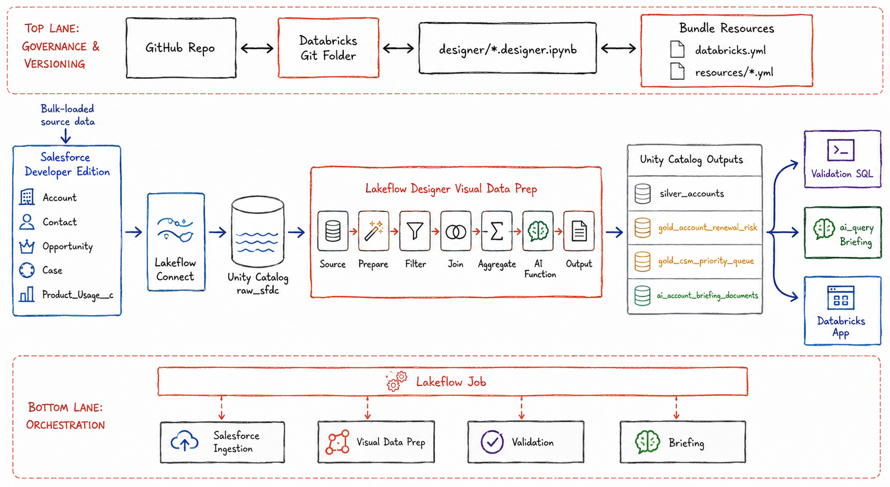
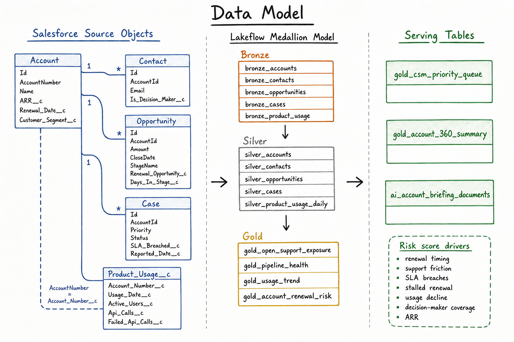

# Salesforce Renewal Risk Intelligence Platform

This project is a compact, production-shaped Databricks Lakeflow project for
mid-senior and senior data engineers.

The business problem is simple: a B2B SaaS company wants to know which customers
are at renewal risk, why they are risky, and what action the Customer Success
team should take next.

The engineering goal is richer: implement Lakeflow Connect, Lakeflow Designer
visual data prep, Unity Catalog, Lakeflow Jobs, GitHub versioning from the
Databricks UI, and a small agentic serving layer.

## Architecture



## Data Model



The detailed source, medallion, gold, and AI-serving model is documented in
[`docs/02_data_model.md`](docs/02_data_model.md).

## Important Design Decision

Salesforce is the only source system for this project.

All operational and usage data is loaded into Salesforce first, then ingested
into Databricks through Lakeflow Connect. Salesforce plus Lakeflow Connect is
the supported ingestion path.

The prepared Salesforce dataset contains 2,266 records:

```text
60 Account records
131 Contact records
105 Opportunity records
170 Case records
1800 Product_Usage__c records
```

## What You Build

```text
Salesforce Developer Edition
  Account
  Contact
  Opportunity
  Case
  Product_Usage__c
        |
        | Lakeflow Connect managed ingestion
        v
renewal_risk_lakehouse.raw_sfdc_dev / raw_sfdc_prod
        |
        | Lakeflow Designer visual data prep
        v
trusted entities -> gold risk model -> serving tables
        |
        +--> CSM priority queue
        +--> ai_query account briefing
        +--> optional Databricks App
```

`lfc_salesforce_ingestion_dev` and `lfc_salesforce_ingestion_prod` are the
raw/bronze ingestion pipelines. Lakeflow
Connect performs an initial load first, then uses Salesforce cursor columns such
as `SystemModstamp` or `LastModifiedDate` for incremental reads on later runs.
Lakeflow Designer reads the current raw Delta table state. For efficient
silver/gold refreshes, prefer Materialized view outputs in Designer where
available; use Lakeflow Declarative Pipelines for strict row-by-row streaming or
CDC transformation requirements.

Environment setup is handled in two layers:

```text
scripts/bootstrap_unity_catalog.py
  -> runs setup/00_create_catalog_and_schemas.sql before bundle deploy
  -> creates or verifies catalog and schemas idempotently

databricks bundle deploy
  -> deploys Lakeflow Connect ingestion pipeline

job_renewal_risk_environment_bootstrap_dev / job_renewal_risk_environment_bootstrap_prod
  -> setup/00_create_catalog_and_schemas.sql
  -> manual repair or verification after deployment
```

The `pipeline_events` schema is shared, but each bundle target uses a different
Lakeflow Connect event log table:

```text
dev target  -> lfc_salesforce_ingestion_event_log_dev
prod target -> lfc_salesforce_ingestion_event_log_prod
```

## Why `databricks.yml` And `resources/` Exist

These files do not mean that the pipelines are already created in Databricks.

They are the Git-tracked project configuration used by Databricks Declarative
Automation Bundles.

In the Databricks UI, you still create/deploy/run the Lakeflow project from the
Git folder. The files under `resources/` describe deployable Databricks assets
that belong to the project:

- Salesforce Lakeflow Connect ingestion pipeline.
- Environment bootstrap job for Unity Catalog setup.
- Visual job template that can be enabled after the Designer file is committed.

The practical message is:

```text
Lakeflow Designer = where developers build and debug the visual pipeline.
GitHub = where source files and pipeline configuration are versioned.
Bundle files = how Databricks keeps the project resources reproducible.
```

## Runtime Vs Setup Files

The Lakeflow runtime does not execute the Salesforce setup utilities.

Databricks Lakeflow reads only from Salesforce objects ingested into
target-specific raw schemas: `renewal_risk_lakehouse.raw_sfdc_dev` for dev and
`renewal_risk_lakehouse.raw_sfdc_prod` for prod. The Salesforce files and Python
utilities exist only to prepare the source system before Lakeflow Connect runs.

Runtime files used by Databricks:

```text
databricks.yml
resources/*.yml
designer/*.designer.ipynb
setup/*.sql
src/app/*
```

`designer/*.designer.ipynb` is created from the Databricks UI after the visual
data prep is built inside the Databricks Git folder.

Salesforce setup files used before Databricks ingestion:

```text
sfdx-project.json
salesforce/force-app/**
src/generate_project_data.py
src/prepare_child_bulk_files.py
data/salesforce-bulk/**
```

`sfdx-project.json` is Salesforce CLI project configuration. It lets the
Salesforce CLI deploy the custom object and custom fields in
`salesforce/force-app`.

`src/prepare_child_bulk_files.py` is a local helper used after Account records
are bulk-loaded into Salesforce. It replaces `AccountNumber` in child-object
source files with Salesforce-generated `AccountId` values so Contact,
Opportunity, and Case records can be bulk-loaded correctly.

Those generated child load files are intentionally ignored by Git because they
contain org-specific Salesforce IDs:

```text
data/salesforce-bulk/account_id_map.csv
data/salesforce-bulk/load/Contact.csv
data/salesforce-bulk/load/Opportunity.csv
data/salesforce-bulk/load/Case.csv
```

## Project Files

```text
.github/
  workflows/
    databricks-bundle.yml
databricks.yml
resources/
  environment_bootstrap_job.yml
  salesforce_ingestion_pipeline.yml
  renewal_risk_visual_job.yml.example
scripts/
  bootstrap_unity_catalog.py
salesforce/
  force-app/
    main/default/objects/Account/fields/
    main/default/objects/Contact/fields/
    main/default/objects/Opportunity/fields/
    main/default/objects/Case/fields/
    main/default/objects/Product_Usage__c/
sfdx-project.json
designer/
  README.md
  renewal_risk_visual_data_prep.designer.ipynb  # created from Databricks UI
src/
  generate_project_data.py
  app/
    app.py
    app.yaml
    requirements.txt
setup/
  00_create_catalog_and_schemas.sql
  03_ai_query_account_briefing.sql
data/
  salesforce-bulk/
docs/
  01_problem_statement.md
  02_data_model.md
  03_salesforce_setup.md
  04_databricks_setup.md
  05_lakeflow_ui_build.md
  06_versioning_and_orchestration.md
  07_agentic_layer.md
  08_project_runbook.md
```

## Implementation Strategy

Use Databricks UI for the primary implementation path:

1. Create Salesforce Developer Edition.
2. Deploy the Salesforce object and field metadata.
3. Bulk load Account records.
4. Export Salesforce-generated Account IDs.
5. Prepare child-object bulk files.
6. Bulk load Contact, Opportunity, Case, and Product_Usage__c records.
7. Create a Salesforce Unity Catalog connection.
8. Set `sql_warehouse_id` in `databricks.yml` for the decoupled environment bootstrap job.
9. Clone this repo into a Databricks Git folder.
10. Deploy the bundle project from the Databricks UI.
11. Run the target-specific environment bootstrap job when manual repair or verification is needed.
12. Use Lakeflow Connect to ingest Account, Contact, Opportunity, Case, and
   Product_Usage__c.
13. Create `designer/renewal_risk_visual_data_prep` from Lakeflow Designer.
14. Add Source, Prepare, Filter, Join, Aggregate, AI Function, and Output
    operators on the canvas.
15. Write final outputs to `renewal_risk_lakehouse.renewal_risk_dev` while building in Designer.
16. Add the visual data prep to the Lakeflow Job; the bundle target passes the output schema at runtime.
17. Use `ai_query` or the optional Databricks App for account briefings.
18. Commit and push the `.designer.ipynb` file back to GitHub from Databricks.

## Lakeflow Designer Build Plan

Build the transformation in Databricks Visual Data Prep. Do not recreate the
transformation as handwritten SQL.

Create the visual data prep inside the Databricks Git folder:

```text
designer/renewal_risk_visual_data_prep
```

After the first save and Git commit, Databricks stores the visual artifact as:

```text
designer/renewal_risk_visual_data_prep.designer.ipynb
```

In the Databricks Workspace browser, it can still appear as
`renewal_risk_visual_data_prep` with type `Visual data prep`. That is expected;
the `.designer.ipynb` name is visible through Git changes, export, GitHub, or a
local pull.

That file is the main transformation artifact for this project.

### Source Operators

Add one Source operator per Salesforce object ingested by Lakeflow Connect:

```text
src_account       -> renewal_risk_lakehouse.raw_sfdc_dev.Account
src_contact       -> renewal_risk_lakehouse.raw_sfdc_dev.Contact
src_opportunity   -> renewal_risk_lakehouse.raw_sfdc_dev.Opportunity
src_case          -> renewal_risk_lakehouse.raw_sfdc_dev.Case
src_product_usage -> renewal_risk_lakehouse.raw_sfdc_dev.Product_Usage__c
```

### Trusted Entity Operators

Use Prepare and Filter operators to build trusted entities:

```text
src_account
  -> prep_accounts
  -> output silver_accounts

src_contact
  -> prep_contacts
  -> filter_valid_contacts
  -> output silver_contacts

src_opportunity
  -> prep_opportunities
  -> filter_valid_opportunities
  -> output silver_opportunities

src_case
  -> prep_cases
  -> filter_valid_cases
  -> output silver_cases

src_product_usage
  -> prep_product_usage
  -> filter_valid_usage
  -> output silver_product_usage_daily
```

Core filters:

```text
account_id is not null
account_number is not null
email contains @
priority is one of Low, Medium, High, Critical
active_users >= 0
api_calls >= 0
failed_api_calls >= 0
```

### Gold Signal Operators

Use Aggregate and Join operators to create reusable risk signals:

```text
silver_cases
  -> agg_support_exposure
  -> output gold_open_support_exposure

silver_opportunities
  -> agg_pipeline_health
  -> output gold_pipeline_health

silver_contacts
  -> agg_decision_makers

silver_product_usage_daily + silver_accounts
  -> join_usage_accounts
  -> agg_usage_trend
  -> output gold_usage_trend
```

Important metrics:

```text
open case count
open high-priority case count
open SLA breach count
oldest case age
renewal pipeline amount
stalled renewal opportunity count
active expansion opportunity count
latest 14-day active users
previous 14-day active users
active user growth rate
API failure rate
decision-maker count
```

### Renewal Risk Operators

Join the trusted Account branch with the gold signal branches:

```text
silver_accounts
  -> join_support_exposure
  -> join_pipeline_health
  -> join_usage_trend
  -> join_decision_makers
  -> prep_renewal_risk
  -> output gold_account_renewal_risk
```

Create these calculated columns in `prep_renewal_risk`:

```text
days_to_renewal
risk_score
risk_band
recommended_action
```

Risk score:

```text
+30 renewal due within 90 days
+25 open high-priority support case exists
+15 open SLA breach exists
+15 stalled renewal opportunity exists
+15 product usage dropped by at least 10 percent
+10 no decision-maker contact exists
+10 high-value account by ARR
-10 active expansion opportunity exists
```

Risk band:

```text
80-100 Critical
60-79  High
35-59  Medium
0-34   Low
```

### Serving Operators

Create the action queue:

```text
gold_account_renewal_risk
  -> filter_actionable_accounts
  -> sort_priority_queue
  -> output gold_csm_priority_queue
```

Filter:

```text
risk_band is Critical, High, or Medium
```

Sort:

```text
risk_score descending
arr descending
days_to_renewal ascending
```

Create AI briefing context:

```text
gold_account_renewal_risk
  -> prep_account_360_summary
  -> output gold_account_360_summary
  -> prep_ai_briefing_documents
  -> output ai_account_briefing_documents
```

The briefing text should include:

```text
account name
customer segment
ARR
renewal date
risk band
risk score
support exposure
usage trend
decision-maker coverage
recommended action
```

### Output Locations

During build and testing, use:

```text
renewal_risk_lakehouse.renewal_risk_dev
```

For production-style promotion, use:

```text
renewal_risk_lakehouse.renewal_risk
```

Use Output operators with table or materialized view output depending on the
workspace capability available. For the project walkthrough, managed Unity
Catalog table outputs are the most direct option.

## Git And CI/CD Flow

The visual canvas is versioned because it lives inside a Databricks Git folder.

There are two Databricks workspace locations involved, and they should not be
treated as the same thing:

```text
Databricks Git folder
  -> cloned from GitHub
  -> used by you for Lakeflow Designer authoring
  -> changes are committed and pushed back to GitHub

.bundle deployment folder
  -> created by databricks bundle deploy
  -> used by jobs and pipelines at runtime
  -> never edited manually
```

Branch strategy:

```text
push to dev                 -> run setup SQL, validate, deploy dev
merged PR from dev to main  -> run setup SQL, validate, deploy prod
```

Developer flow:

```text
Databricks Git folder
  -> create visual data prep in designer/
  -> build canvas
  -> run and preview nodes
  -> commit .designer.ipynb
  -> push to GitHub
```

Review flow:

```text
dev branch
  -> pull request to main
  -> review .designer.ipynb, resource YAML, setup scripts, docs
  -> merge to main
```

Deployment flow:

```text
GitHub Actions
  -> push to dev deploys dev target
  -> merged PR from dev to main deploys prod target
```

On push to `dev`, the workflow runs:

```text
python3 scripts/bootstrap_unity_catalog.py
databricks bundle validate --target dev
databricks bundle deploy --target dev
```

After a PR from `dev` to `main` is merged, the workflow runs:

```text
python3 scripts/bootstrap_unity_catalog.py
databricks bundle validate --target prod
databricks bundle deploy --target prod
```

The `prod` target sets an explicit `workspace.root_path` in `databricks.yml`.
Databricks requires this for production-mode bundle targets so production always
deploys to one stable workspace location.

The workflow file is included at:

```text
.github/workflows/databricks-bundle.yml
```

Required GitHub Actions configuration:

```text
DATABRICKS_HOST   -> GitHub repository or environment secret
DATABRICKS_TOKEN  -> GitHub repository or environment secret
```

`DATABRICKS_HOST` is the Databricks workspace URL, for example
`https://dbc-xxxx.cloud.databricks.com`.

`DATABRICKS_TOKEN` is a Databricks personal access token created from the
Databricks workspace. Store both values as GitHub secrets, not as normal
variables and never in source control.

Recommended orchestration after the Designer file exists:

```text
Lakeflow Job
  -> refresh_salesforce_ingestion
  -> run_renewal_risk_visual_data_prep
```

The same committed Designer file is used for dev and prod. The bundle target
passes `pipeline_schema` into the visual notebook task:

```text
dev target  -> renewal_risk_dev
prod target -> renewal_risk
```

So the Designer UI can stay configured to the development schema, while the
deployed production job writes to `renewal_risk_lakehouse.renewal_risk`.

The job template is intentionally parked as:

```text
resources/renewal_risk_visual_job.yml.example
```

After `designer/renewal_risk_visual_data_prep.designer.ipynb` exists in Git,
copy the example to:

```text
resources/renewal_risk_visual_job.yml
```

Then deploy the bundle again.

This prevents CI/CD from trying to deploy a job that points to a Designer file
before the file has been created in Databricks.

## Official Docs Used

The setup guidance was checked on 2026-09-04 against current Databricks and
Salesforce documentation:

- Databricks bundles in the workspace:
  https://docs.databricks.com/aws/en/dev-tools/bundles/workspace
- Databricks deploy bundles from the workspace:
  https://docs.databricks.com/aws/en/dev-tools/bundles/workspace-deploy
- Databricks Lakeflow Designer:
  https://docs.databricks.com/aws/en/designer/what-is-lakeflow-designer
- Databricks visual data prep production flow:
  https://docs.databricks.com/aws/en/designer/production
- Databricks Salesforce Lakeflow Connect:
  https://docs.databricks.com/aws/en/ingestion/lakeflow-connect/salesforce-pipeline
- Databricks Lakeflow Designer built-in operators:
  https://docs.databricks.com/aws/en/designer/built-in-operators
- Salesforce CLI bulk import:
  https://developer.salesforce.com/docs/platform/salesforce-cli-reference/guide/cli_reference_data_import_bulk.html
- Salesforce CLI query command:
  https://developer.salesforce.com/docs/platform/salesforce-cli-reference/guide/cli_reference_data_query.html
- Salesforce Developer Edition storage allocations:
  https://help.salesforce.com/s/articleView?id=xcloud.overview_storage.htm
